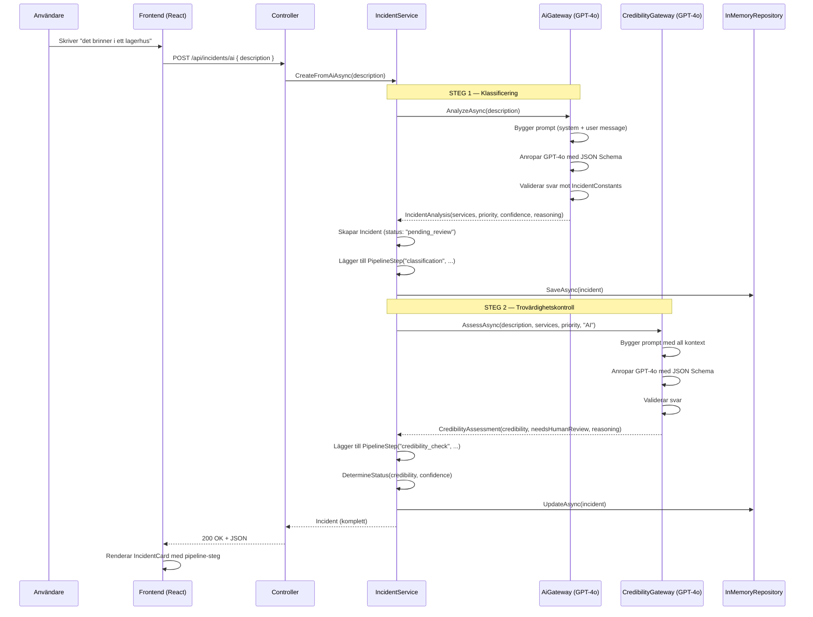

# AI Flow — Från request till svar

## AI-ärende (POST /api/incidents/ai)



---

## Manuellt ärende (POST /api/incidents/manual)

Samma flöde men **utan Steg 1** (klassificering):

1. Användaren väljer tjänster + prioritet själv
2. `POST /api/incidents/manual` → `CreateManualAsync(description, services, priority)`
3. Incident skapas med `CreatedBy: "User"`, `Confidence: null`
4. **Hoppar direkt till Steg 2** (trovärdighetskontroll)
5. Status bestäms: null confidence behandlas som 1.0 → bara credibility avgör

---

## Statuslogik (DetermineStatus)

| Credibility | Confidence | → Status |
|-------------|-----------|----------|
| `high` | any | `ongoing` |
| `medium` | ≥ 0.6 | `ongoing` |
| `medium` | < 0.6 | `flagged` |
| `low` | any | `flagged` |

> Manuella ärenden: Confidence = null → behandlas som 1.0

---

## Felhantering

Om GPT-4o-anropet i trovärdighetschecken misslyckas:

1. Incident sparas ändå
2. Status → `"flagged"`, NeedsHumanReview → `true`
3. PipelineStep loggas med `"ERROR"` + felmeddelande
4. Exception loggas via ILogger

---

## Operatörsflöde i frontend

Varje kort visar:
- Beskrivning, metadata, status-badge
- **Pipeline-steg** med ✅/❌ och AI:ns motivering
- Flaggade ärenden → **Godkänn/Avvisa-knappar** (PATCH status → `ongoing` / `rejected`)

---

## Statuslivscykel

```
pending_review → ongoing     (trovärdig)
pending_review → flagged     (låg trovärdighet / AI-fel)
flagged        → ongoing     (operatör godkänner)
flagged        → rejected    (operatör avvisar)
ongoing        → closed      (ärende avslutat)
```
